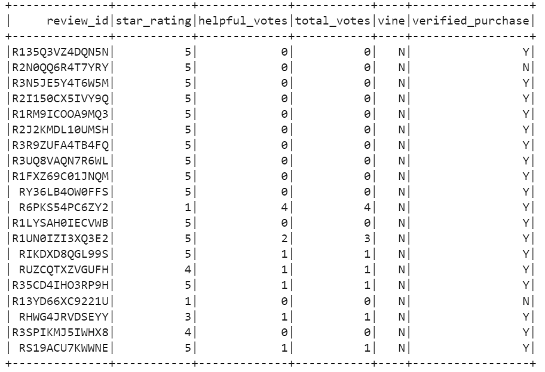

# Amazon_Vine_Analysis
Amazon Vine program is a service that allows in this case the manufacturer of Jewelry to receive reviews for its products.

## Overview of Project 
### Purpose
The purpose of the project is to analyze Amazon reviews written by members of the paid Amazon Vine Program. The number of total reviews with Vine program paid and unpaid, the total 5-star reviews also with Vine program paid and unpaid, and finally the percentage of 5-star reviews with Vine program paid and unpaid. So, we get the jewelry dataset, Extract it from Amazon using Pyspark, transform it on Google collaborate and connect it to an AWS RDS instance, and finally Load the transformed data on SQL, accomplishing the ETL process. In the end, we use again PySpark to analyze the clean data.

## Results 

*How many Vine reviews and non-Vine reviews were there?
----
There are 21 reviews in total vine program paid, and 7,689 reviews in total unpaid. So, we can see that less than 1% of are vine reviews program paid.

*How many Vine reviews were 5 stars? How many non-Vine reviews were 5 stars?
---
There are 11 5-star Reviews in total vine program paid, and 4,444 5-star Reviews unpaid. In this case, we can see that also less than the 1% are vine reviews paid. 

*What percentage of Vine reviews were 5 stars? What percentage of non-Vine reviews were 5 stars?
--
        percentageSR_paid = (Total_StarReview_paid / Total_Reviews_paid) *100
        percentageSR_paid = (11/ 21) *100 = 52%
        
The percentage of Vine Reviews were 5-stars is 52%.

        percentageSR_unpaid = (Total_StarReview_unpaid / Total_Reviews_unpaid ) * 100
        percentageSR_unpaid= (4444/7689)* 100 = 58%
        
The percentage of non-Vine reviews were 5-stars is 58%.        

### Summary
According to the results, there is no a positivity bias for reviews in the Vine program, the percentage of non-Vine reviews were 5 stars is bigger than the percentage of Vine Reviews were 5 stars. To a depper analysis we could use a correlation between the product and the reviews, and observe is a specific product is given the negativity bias.
